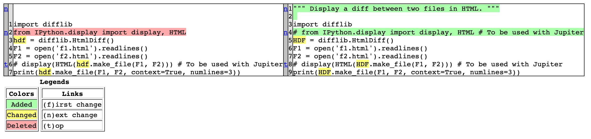

<div align="center">

# Diff

Display a diff between two files in HTML.

[](https://travis-ci.com/Justintime50/diff)
[](https://coveralls.io/github/Justintime50/diff?branch=master)
[](https://pypi.org/project/diff-tool)
[](https://opensource.org/licenses/mit-license.php)



</div>

Running this tool requires two files to compare. It will output the **diff**erence to an HTML file which can be viewed in a browser to see what changed between files.

## Install

```bash
# Install tool
pip3 install diff-tool

# Install locally
make install

# Get Makefile help
make help
```

## Usage

```
Usage:
    diff-tool -f1 /path/to/file1.txt -f2 /path/to/file2.txt -o path/to/diff.html

Options:
    -h, --help            show this help message and exit
    -f1 FILE1, --file1 FILE1
                            The path to the base file to compare a second file to.
    -f2 FILE2, --file2 FILE2
                            The path to the second file compared to the base file.
    -o OUTPUT, --output OUTPUT
                            The path to the output file including filename..
```

## Development

```bash
# Lint the project
make lint

# Run tests
make test

# Run the tool locally
venv/bin/python diff/diff_files.py --help
```
